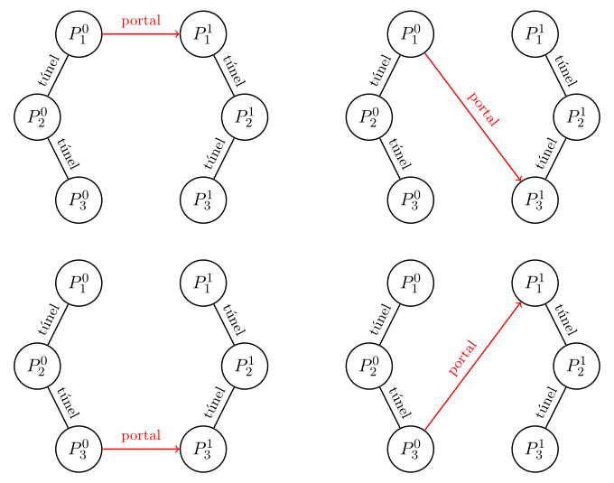

# Problema H - Carrera galáctica

En la galaxia de la Vía Láctea existen $N$ planetas habitables, numerados del 1
al $N$. Algunos planetas están conectados mediante túneles hiperespaciales
estables, que permiten a las naves viajar de forma instantánea entre ellos.
Existen exactamente $N - 1$ túneles de este tipo, y cualquier planeta puede
alcanzarse desde cualquier otro siguiendo dichos túneles.

Además, el Consejo Interestelar ha confirmado la existencia de $D$ galaxias
idénticas a la Vía Láctea.  Cada galaxia contiene exactamente los mismos
planetas y los mismos túneles hiperespaciales. Estas galaxias están numeradas
del 1 al $D$ (nuestra galaxia tiene índice 0). Denotamos el planeta $x$ en la
galaxia $i$ como $P_x^i$.

Las naves estelares pueden desplazarse entre galaxias mediante portales
cuánticos intergalácticos. Para cada $i$ con $0 \leq i \leq D - 1$, se activa
exactamente un portal que permite viajar desde $P_{A_i}^i$ hasta
$P_{B_i}^{i+1}$, para ciertos índices $A_i$ y $B_i$ con
$1 \leq A_i, B_i \leq N$.

Tras activar todos los portales, la flota de exploración inicia su misión. Los
dos comandantes más reputados, **Aries** y **Libra**, comienzan estacionados en
$P_1^0$. Alternando turnos, eligen un planeta al que viajar. El planeta elegido
debe ser alcanzable desde su posición actual, ya sea mediante un túnel
hiperespacial en la misma galaxia o mediante un portal cuántico hacia otra
galaxia. Su objetivo es explorar territorios nunca visitados. Una vez visitado
$P_x^i$, no puede volverse a este (aunque sí puede visitarse el planeta $x$ en
otra galaxia). Aries elige en primer lugar; luego, Libra; después, Aries, y así
sucesivamente. Si un comandante no puede moverse a un planeta aún no visitado,
pierde.

Ambos comandantes conocen toda la topología de túneles y portales y juegan de
manera óptima.  Determinar cuántas configuraciones posibles de portales
permiten la victoria de Aries. Dos configuraciones se consideran distintas si
existe un índice $i$ ($0 \leq i \leq D - 1$) tal que difieren los pares
$(A_i, B_i)$.

Como el número puede ser enorme, el resultado debe calcularse módulo $10^9 + 7$.

## Entrada

La primera línea contiene dos enteros $N$ y $D$.

Cada una de las siguientes $N - 1$ líneas contiene dos enteros $u$ y $v$,
indicando que para toda galaxia $i$, los planetas $P_u^i$ y $P_v^i$ están
conectados mediante un túnel hiperespacial.

## Salida

Imprimir un único entero: el número de configuraciones de portales en las que
Aries gana, módulo $10^9 + 7$.

## Entrada de ejemplo
```
3 1
1 2
2 3
```

## Salida de ejemplo
```
4
```

**Explicación:** Existe un único portal y $3 \cdot 3 = 9$
configuraciones posibles. Las siguientes 4 permiten
a Aries obtener la victoria:



## Restricciones

- $2 \leq N \leq 10^5$
- $1 \leq D \leq 10^5$
- $1 \leq u, v \leq N$

**Límite de tiempo** 0.2 seg.
**Límite de memoria** 32 MiB
